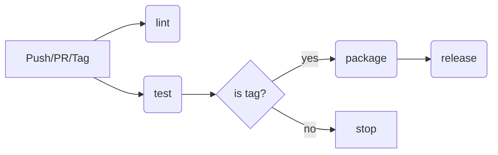

# Learning-action

学习使用 GitHub Actions 的 CI/CD 功能，基于 PyQt5 桌面应用的完整流程示例。

## 项目结构

```
.
├── .github/workflows/
│   ├── build.yml             # CI/CD 工作流
│   └── build-example.yml     # EchoMusic 开源项目参考
├── tests/
│   ├── conftest.py           # pytest 配置（offscreen 模式）
│   └── test_main.py          # 22 个测试用例
├── main.py                   # PyQt5 影像报告系统
├── requirements.txt          # Python 依赖
├── .env.example              # 环境变量模板
└── README.md
```

## 技术栈

| 组件 | 版本 |
|------|------|
| Python | 3.10.6 |
| PyQt5 | 5.15.11+ |
| pytest | 8+ |
| GitHub Actions | Ubuntu latest |

## CI/CD 工作流

定义在 `.github/workflows/build.yml`，共 4 个 Job，**按需串行**：



### Job 说明

| Job | 触发条件 | 作用 |
|-----|----------|------|
| **lint** | 所有 push/PR/tag | 语法检查 + 验证 PyQt5 可导入 |
| **test** | 所有 push/PR/tag | Python 3.9/3.10/3.11 三版本并行跑 22 个测试 |
| **package** | 仅 tag `v*` | PyInstaller 打包为 Linux 可执行文件 |
| **release** | 仅 tag `v*` | 创建 GitHub Release 并上传产物 |

### 触发方式

```yaml
on:
  push:
    branches: [ "main" ]     # 推送到 main
    tags: [ "v*" ]           # 推送 v 开头的 tag
  pull_request:
    branches: [ "main" ]     # PR 到 main
  workflow_dispatch:          # 手动触发
```

## 发布版本（Release）

### 正式版

```bash
git tag v1.0.0
git push origin v1.0.0
```

### Beta / 预发布版

```bash
git tag v1.0.0-beta.1
git push origin v1.0.0-beta.1
```

根据语义化版本约定：tag 名包含 `-` 的自动标记为 **Pre-release**（如 `v1.0.0-beta.1`、`v1.0.0-rc.1`），不包含的为**正式版**。

```yaml
prerelease: ${{ contains(github.ref_name, '-') }}
```

## 本地开发

### 安装

```bash
# 1. 安装系统依赖（PyQt5 xcb 插件）
sudo apt install -y libxcb-icccm4 libxcb-image0 \
  libxcb-keysyms1 libxcb-render-util0 libxcb-xinerama0

# 2. 安装 Python 依赖
pip install -r requirements.txt
pip install pytest pyinstaller

# 3. 配置环境变量
cp .env.example .env
```

### 运行

```bash
python main.py
```

### 测试

```bash
python -m pytest tests/ -v
```

测试使用 `offscreen` 模式运行，无需显示器。

### 打包

```bash
pyinstaller --onedir --name 影像报告系统 --windowed main.py
```

## 环境变量

参考 `.env.example`：

```
SERVER_HOST=http://localhost
SERVER_PORT=8000
API_BASE_URL=${SERVER_HOST}:${SERVER_PORT}/api/v1
AUTH_TOKEN=
APP_ENV=development
```

`.env` 存放真实值（不提交到 Git），`.env.example` 存放模板（提交到 Git）。

## 参考：EchoMusic 构建文件

`build-example.yml` 是一个成熟的开源 Electron 桌面应用 CI/CD 示例，包含：

- Matrix 多 OS 构建（macOS/Linux/Windows × arm64/x64）
- libmpv 跨平台下载（brew / apt / 预编译包）
- changelog 自动提取
- Telegram + QQ 通知
- 预发布版本识别

核心设计直接参考了该项目的模式。
